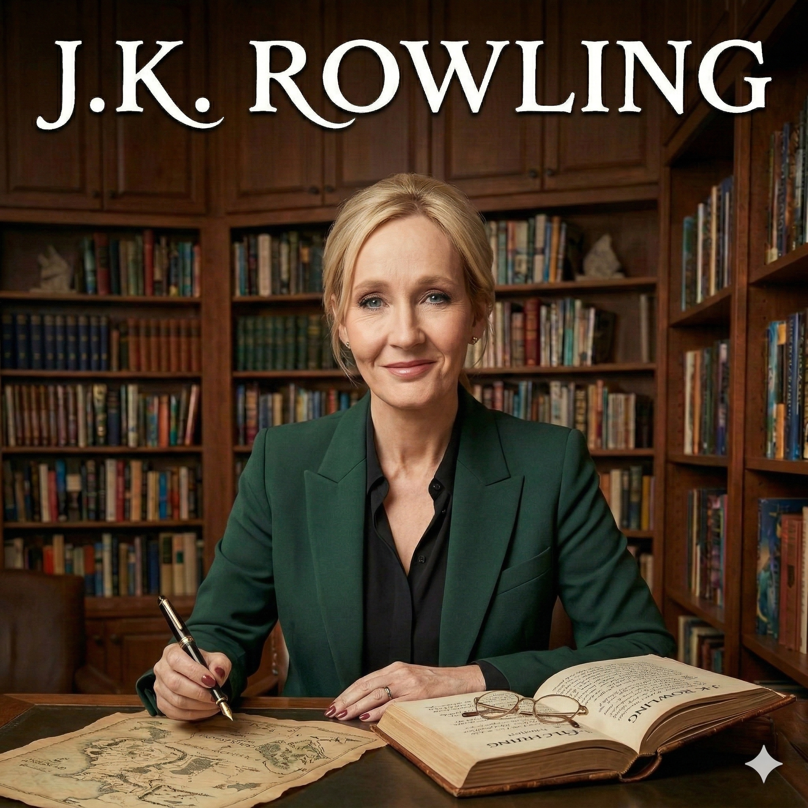

# J.K. Rowling

| | |
|---|---|
| Full Name | Joanne Rowling |
| Born | July 31, 1965 |
| Nationality | British |
| Birthplace | Yate, Gloucestershire, England |
| Education | University of Exeter |
| Occupation | Author, Philanthropist |
| Genre | Fantasy, Drama, Young Adult, Crime Fiction |
| Website | [jkrowling.com](https://www.jkrowling.com) |

---

## 📖 About

J.K. Rowling is a British author and philanthropist. She wrote *Harry Potter*, a seven-volume children's fantasy series published from 1997 to 2007. The series has sold over 500 million copies, been translated into at least 70 languages, and spawned a global media franchise including films and video games. 

---

## ✍️ Writing Style

- **World-Building**: Renowned for creating expansive, intricate, and deeply imaginative magical worlds alongside the mundane everyday world.
- **Mystery Mechanics**: Often structures her fantasy novels as mysteries, with hidden clues, red herrings, and major reveals at the climax.
- **Relatable Protagonists**: Focuses on the coming-of-age journey, placing ordinary (or seemingly ordinary) children into extraordinary, high-stakes situations.

---

## 📚 Bibliography

### ⚡ The Harry Potter Series

| **#** | **Title** | **Year** | **Read** |
|:---:|:---|:---:|:---:|
| 1 | [Harry Potter and the Philosopher's Stone](../titles/harry_potter_and_the_philosophers_stone.md) | 1997 | ✅ |
| 2 | [Harry Potter and the Chamber of Secrets](../titles/harry_potter_and_the_chamber_of_secrets.md) | 1998 | ✅ |
| 3 | Harry Potter and the Prisoner of Azkaban | 1999 | ❌ |
| 4 | Harry Potter and the Goblet of Fire | 2000 | ❌ |
| 5 | Harry Potter and the Order of the Phoenix | 2003 | ❌ |
| 6 | Harry Potter and the Half-Blood Prince | 2005 | ❌ |
| 7 | Harry Potter and the Deathly Hallows | 2007 | ❌ |

#### Companion Books
| **Title** | **Year** | **Read** |
|:---|:---:|:---:|
| Fantastic Beasts and Where to Find Them | 2001 | ❌ |
| Quidditch Through the Ages | 2001 | ❌ |
| The Tales of Beedle the Bard | 2008 | ❌ |

---

### 🕵️ Cormoran Strike Series *(as Robert Galbraith)*

| **#** | **Title** | **Year** | **Read** |
|:---:|:---|:---:|:---:|
| 1 | The Cuckoo's Calling | 2013 | ❌ |
| 2 | The Silkworm | 2014 | ❌ |
| 3 | Career of Evil | 2015 | ❌ |
| 4 | Lethal White | 2018 | ❌ |
| 5 | Troubled Blood | 2020 | ❌ |
| 6 | The Ink Black Heart | 2022 | ❌ |
| 7 | The Running Grave | 2023 | ❌ |

---

### 🌊 Standalone

| **Title** | **Year** | **Read** |
|:---|:---:|:---:|
| The Casual Vacancy | 2012 | ❌ |
| The Ickabog | 2020 | ❌ |
| The Christmas Pig | 2021 | ❌ |

---

## 🌟 Personal Highlights

| Book | Rating |
|:---|:---:|
| [Harry Potter and the Philosopher's Stone](../titles/harry_potter_and_the_philosophers_stone.md) | 7.0/10 |
| [Harry Potter and the Chamber of Secrets](../titles/harry_potter_and_the_chamber_of_secrets.md) | 8.5/10 |
| **Average** | **7.75/10** |

---

*Last Updated: 28th March 2026*
