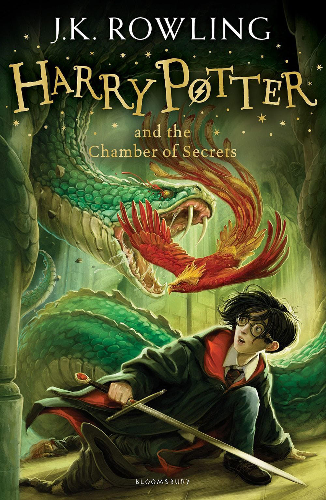

# Harry Potter and the Chamber of Secrets

| | |
|---|---|
| Original Title | Harry Potter and the Chamber of Secrets |
| Alternative Title | - |
| Publication Year | 1998 |
| Author | [J.K. Rowling](../authors/jk_rowling.md) |
| Publisher | Pottermore Publishing |
| Language | Original: English / Read In: English |
| Genre | Fantasy, Young Adult, Children's Fiction |
| Format | Paperback |
| Status | Reading |
| Pages Read | 0 / 269 |
| Purchase Date | 27th March 2025 |
| Purchase Platform | BookOwls |
| Purchase Price | 244.71 BDT |
| Total Read Time | - |
| Start Date | 15th March 2026 |
| Last Read | 15th March 2026 |
| End Date | - |
| Rating | - |

## Overview

TBD

## Story & World

TBD

## Characters

TBD

## Writing Style & Prose

TBD

## Themes & Impact

TBD

## Personal Notes & Observations

TBD

### Rating Breakdown

| Category | Score | Notes |
|---|---|---|
| **Writing Style** | **-** | - |
| **Plot** | **-** | - |
| **World-building** | **-** | - |
| **Character Development** | **-** | - |
| **Enjoyment** | **-** | - |
| **Pace** | **-** | - |
| **Overall** | **-** | **-** |

## Verdict

TBD

---

## Reread Value

**Would I reread?** TBD

**Best for:**

**Similar books:**
