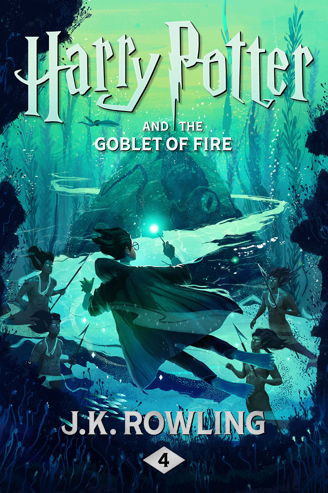

# Harry Potter and the Goblet of Fire

| | |
|---|---|
| Original Title | Harry Potter and the Goblet of Fire |
| Alternative Title | - |
| Publication Year | 2000 |
| Author | [J.K. Rowling](../authors/jk_rowling.md) |
| Publisher | Pottermore Publishing |
| Language | Original: English / Read In: English |
| Genre | Fantasy, Young Adult, Children's Fiction |
| Format | Paperback |
| Status | Completed |
| Pages Read | 700 / 700 |
| Purchase Date | 28th Feb 2026 |
| Purchase Platform | BookOwls |
| Purchase Price | 494 BDT |
| Total Read Time | 19 hours 51 minutes |
| Start Date | 2nd April 2026 |
| Last Read | 20th April 2026 |
| End Date | 20th April 2026 |
| Rating | 9 / 10 |

## Overview

Right. So *Prisoner of Azkaban* had me convinced the series had already peaked. A 10/10, no contest — tight plotting, emotional gut-punches, a twist that reframes everything. I genuinely thought: where do you go from there?

Turns out, you go to the Quidditch World Cup. And then a graveyard. And then you never feel quite the same again.

*Goblet of Fire* is the book where the Harry Potter series grows up in the most abrupt, almost violent way possible. At 700 pages, it's nearly double the length of *Prisoner of Azkaban*, and it earns almost every single one of them. Year four at Hogwarts brings the Triwizard Tournament — a legendary and legendarily dangerous inter-school competition — alongside everything that comes with it: international wizards, dragons, mermaids, an impossibly treacherous maze, and the slow, creeping dread of something much darker assembling in the background.

This is the entry point of no return. After this book, Harry Potter is no longer a children's story wearing fantasy clothes. It's something else entirely.

## Story & World

The sheer *scale* of this book compared to its predecessors is immediately noticeable. Where *Philosopher's Stone* gave us a magical school to discover, *Chamber of Secrets* gave us a mystery to solve, and *Prisoner of Azkaban* gave us a deeply personal reckoning with Harry's past — *Goblet of Fire* gives us all of that simultaneously, and then raises the stakes to a level that can't be undone.

The Triwizard Tournament is an excellent structural device. It gives the story a built-in three-act rhythm — the three tasks — while letting Rowling explore the wider wizarding world in ways the Hogwarts grounds never could. Beauxbatons and Durmstrang feel genuinely distinct, the Quidditch World Cup opening is one of the most fun sequences in the entire series, and the Daily Prophet's coverage of everything (mostly wrong, mostly Rita Skeeter's fault) adds a layer of institutional criticism that the earlier books only hinted at.

But the Tournament is also a trap. And the slow unravelling of *who* engineered it and *why* is where the book becomes genuinely masterful. The mystery underpinning everything — the identity of the person who entered Harry's name, the purpose behind it — builds with the same patient setup-and-payoff structure that made *Prisoner of Azkaban*'s Time-Turner sequence so satisfying. Except here, when the payoff comes, it doesn't feel like relief. It feels like dread.

The graveyard chapter is unlike anything else in the series up to this point. Rowling does not look away. Cedric Diggory dies — sudden, pointless, and real — and then Harry watches Voldemort return to a body in a ritual that is genuinely disturbing to read. The series crossed a line there, and it knew it.

## Characters

- **Harry Potter**: This is the year Harry is forced to step into something that is categorically not fair, and he meets it with the kind of stubborn, slightly reckless determination that makes you root for him even when he's being an idiot about Ron. The graveyard sequence is his defining moment so far — not because he wins, but because he doesn't flinch.
- **Ron Weasley**: The rift between Harry and Ron is uncomfortable to read, and deliberately so. Ron's jealousy feels believable — petty in the way a fourteen-year-old's jealousy actually is — and his eventual reconciliation doesn't feel forced. He's not always the best friend. He's a *real* friend.
- **Hermione Granger**: Launches S.P.E.W. Argues with everyone about it. Is completely right. Classic Hermione. Also, she singlehandedly dismantles the most dangerous journalist in the wizarding world armed only with a jar and a beetle inference. The girl operates on a different plane entirely.
- **Cedric Diggory**: Genuinely good. Brave, fair, a little too perfect — which is why his death hits the way it does. He is the first real loss in the series, and it changes the emotional weight of everything that follows.
- **Mad-Eye Moody**: One of the most brilliantly constructed characters in the book, precisely because the version of Moody we spend the entire year with is not actually Moody. The reveal reframes every interaction and makes a reread genuinely uncomfortable. Like Pettigrew hiding in Ron's bedroom — except louder and with a magical eye.
- **Alastor "Real" Moody**: Gets to be saved. That's about it.
- **Voldemort**: Properly back. Not as a memory in a diary, not as a shadow on a professor's skull — but present, embodied, and terrifyingly conversational. His monologue in the graveyard is chilling because of how calm he is. The Killing Curse he fires at Harry is not the scariest moment in that chapter. It's the moment of *Priori Incantatem* and the echo of voices. That's the one that stays with you.

## Writing Style & Prose

Seven hundred pages is a commitment, and *Goblet of Fire* earns it mostly through pacing that trusts the reader. The first half — Quidditch World Cup, arrival at Hogwarts, Tournament announcement — is breezy and fun in the tradition of the earlier books. Rowling uses that lightness deliberately, because the back half needs the contrast.

The prose here is noticeably more confident than the first three books. The comedy is still sharp — any scene with Rita Skeeter, the Beauxbatons arrival, Hagrid's catastrophic attempts at romance — but the dramatic sequences carry genuine weight. The description of Voldemort's rebirthing ritual is the clearest sign yet that Rowling was never writing *just* a children's story. It's unsettling in the right ways.

If there's a weakness, it's length. Certain subplots — particularly the early tournament coverage and some of the Hogwarts bureaucracy — could have been tighter. Compared to *Prisoner of Azkaban*, which felt perfectly lean, *Goblet of Fire* occasionally wanders. But when it focuses, it's exceptional.

## Themes & Impact

- **Fairness and the Illusion of Meritocracy**: The Triwizard Tournament is supposed to be a contest of skill and selection. Harry's name coming from the Goblet is proof that systems can be corrupted by those who understand their rules. The Tournament doesn't care that Harry is fourteen. The rules are the rules.
- **Fear, Courage, and the Gap Between Them**: Like *Prisoner of Azkaban* with the Patronus arc, this book is obsessed with the distinction between bravery and the absence of fear. Harry is terrified through most of the three tasks. He goes anyway. That's the whole point.
- **The Cost of Prejudice**: *Chamber of Secrets* introduced blood purity as a concept; *Goblet of Fire* shows it organized and weaponized. The Death Eaters at the World Cup, Voldemort's reunion with his followers, the casual cruelty toward house-elves — the wizarding world's prejudices aren't just social flaws anymore. They're the engine of something catastrophic.
- **Death as Reality**: This is the first Harry Potter book where someone important actually dies and stays dead. Cedric Diggory doesn't get a Time-Turner reversal, a Fawkes rescue, or a last-minute reveal of innocence. He just dies. And Harry carries the body back. That moment changes the series permanently.

## Personal Notes & Observations

The shift in tone between *Prisoner of Azkaban* and *Goblet of Fire* is one of the most dramatic in any series I've read. *PoA* was emotional and personal — the stakes were intimate. *Goblet* widens the lens to something global, historical, and genuinely frightening. Where *The Titan's Curse* in the Percy Jackson series was the moment that series stopped pulling its punches, *Goblet of Fire* is the equivalent moment for Harry Potter — except Rowling hits harder.

The Priori Incantatem scene is one of the most quietly devastating things in the book. The echoes — James Potter, Lily Potter — arriving to help Harry escape is not triumphant in the way you'd expect. It's just heartbreaking. Parents who should be alive, who cannot be, buying their son a few more seconds to run. It manages to be both relief and grief at the same time.

Also: the moment Harry returns with Cedric's body and refuses to let go of it is the single most gut-wrenching image in the series so far. More than the Sirius permission slip. More than the Patronus. It's a fourteen-year-old boy holding a dead classmate in front of an entire crowd, and Rowling doesn't let the reader look away.

### Rating Breakdown

| Category | Score | Notes |
|---|---|---|
| **Writing Style** | **8.5/10** | More confident than earlier books; some mid-section drag, but the dramatic sequences are Rowling at her best |
| **Plot** | **9.5/10** | A brilliantly constructed mystery underneath a spectacular event — the reveal of Fake Moody is faultless |
| **World-building** | **9.5/10** | The wizarding world finally feels international and lived-in; the Quidditch World Cup and Triwizard history add real depth |
| **Character Development** | **9.0/10** | Harry, Ron, and Hermione all grow in ways that feel earned; Cedric and Fake Moody are outstanding supporting turns |
| **Enjoyment** | **9.0/10** | The first half is pure fun; the second half is compulsively unputdownable for entirely different reasons |
| **Pace** | **8.5/10** | Mostly excellent, though a 700-page book inevitably has sections that breathe a little too long |
| **Overall** | **9.0/10** | **The series' turning point — ambitious, darker, and more emotionally complex than anything that came before** |

## Verdict

*Goblet of Fire* is the book that changes everything. Not because of the Tournament, not because of the maze, not even because of Voldemort — but because of the moment Harry Potter, age fourteen, refuses to let go of a dead boy's body while an entire crowd watches. That's the moment the series became something different.

It's not as lean or emotionally precise as *Prisoner of Azkaban* — nothing in the series probably is — and it takes a while to find its feet beneath all the spectacle. But when it locks in, particularly through the final act, it delivers some of the most affecting pages Rowling has written. The return of Voldemort is terrifying. The graveyard is the series at its darkest. And the fact that Harry survives it by accident of a magical connection, not by triumph or clever planning, is the most honest and devastating thing about the ending.

*Prisoner of Azkaban* proved this series could be extraordinary. *Goblet of Fire* proved it was willing to go somewhere genuinely dark to earn that.

Nine out of ten. No hesitation.

---

## Reread Value

**Would I reread?** Absolutely. Knowing that Moody is Barty Crouch Jr. from the first chapter makes every single interaction read completely differently. It's a book that rewards revisiting.

**Best for:** Readers who've made it through the first three and are ready for the tonal shift; fans of mystery-within-fantasy structures; anyone who thought the series was safe and needs to be proven wrong.

**Similar books:**
- *[Harry Potter and the Prisoner of Azkaban](./harry_potter_and_the_prisoner_of_azkaban.md)* — J.K. Rowling *(the intimate, perfectly structured predecessor — read this first)*
- *[The Last Olympian](./the_last_olympian.md)* — Rick Riordan *(the final-act payoff of a series building toward something larger)*
- *[The Battle of the Labyrinth](./the_battle_of_the_labyrinth.md)* — Rick Riordan *(a darker mid-series entry that expands the world and raises the stakes)*
- *His Dark Materials* — Philip Pullman *(a fantasy series that similarly refuses to spare its young characters)*
