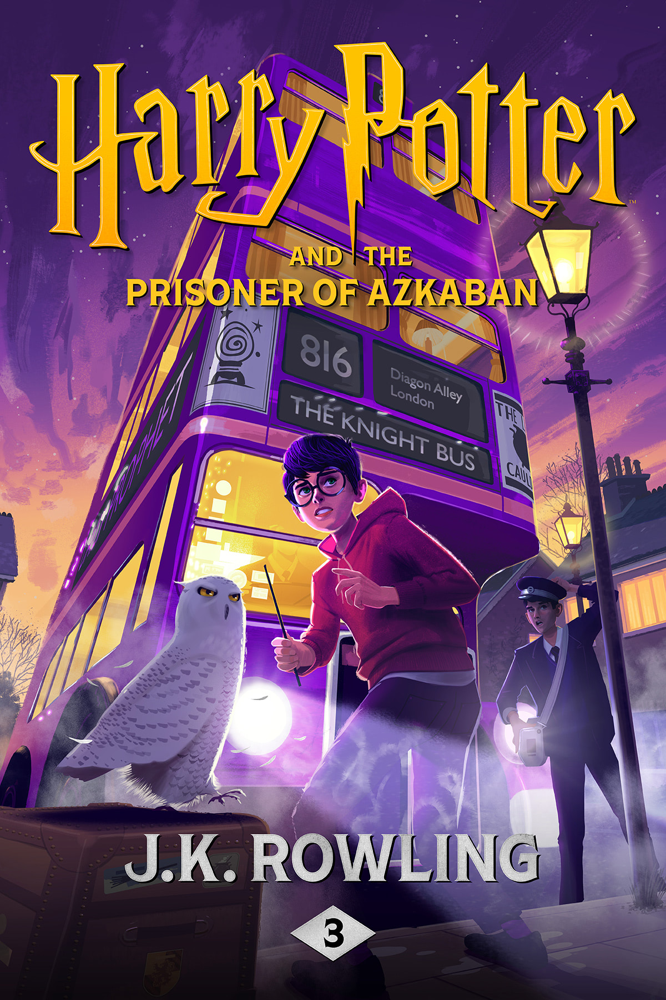

# Harry Potter and the Prisoner of Azkaban

| | |
|---|---|
| Original Title | Harry Potter and the Prisoner of Azkaban |
| Alternative Title | - |
| Publication Year | 1999 |
| Author | [J.K. Rowling](../authors/jk_rowling.md) |
| Publisher | Pottermore Publishing |
| Language | Original: English / Read In: English |
| Genre | Fantasy, Young Adult, Children's Fiction |
| Format | Paperback |
| Status | Completed |
| Pages Read | 348 / 348 |
| Purchase Date | 12th March 2025 |
| Purchase Platform | BookOwls |
| Purchase Price | 301.81 BDT |
| Total Read Time | 10 hours 39 minutes |
| Start Date | 28th March 2026 |
| Last Read | 2nd April 2026 |
| End Date | 2nd April 2026 |
| Rating | 10 / 10 |

## Overview

Okay, let's just say it — *Prisoner of Azkaban* is where the Harry Potter series stops being a charming children's adventure and becomes something genuinely extraordinary. Year three at Hogwarts brings a convicted murderer on the loose, shadowy Dementors guarding the school gates, a new Defense Against the Dark Arts teacher who actually knows what he's doing, and a mystery that turns everything you thought you knew completely on its head.

There's no Horcrux hunt, no dark lord lurking in the back of a professor's skull, no world-ending stakes — and somehow, it's the most emotionally intense book in the series so far. Rowling takes a more personal approach here: this isn't really about saving the world. It's about Harry confronting his darkest fears, learning the truth about his past, and finding out that the most complex villain in the story might not be a villain at all.

## Story & World

The story opens with arguably the funniest exchange in the entire series — Harry casually weaponizing the fact that his godfather is a notorious escaped convict just to get Uncle Vernon off his back. The audacity. The nerve. The *perfection*.

From there, the plot builds with a slow, creeping dread. There's Sirius Black — escaped from Azkaban, supposedly hunting Harry. There are Dementors, soul-sucking creatures stationed at every entrance to Hogwarts that feel genuinely terrifying in a way most magical threats in this series don't. And then there's Professor Lupin, quietly one of the best characters Rowling has ever written, threading together the mystery of the Marauders while being the first Defense teacher who is actually... good at his job?

The twist in the final act is genuinely stunning on first read — the reveal that Scabbers is Peter Pettigrew, that Sirius was innocent the entire time, that the real traitor had been hiding in plain sight for twelve years. It's a masterclass in setup and payoff, and it reframes the entire story in an instant.

## Characters

- **Harry Potter**: This is the book where Harry starts to feel the weight of his own history. The Dementor scenes hit him differently from everyone else, and his gradual mastery of the Patronus charm is a beautiful arc — learning to conjure happiness as an act of defiance against despair.
- **Hermione Granger**: Absolutely unhinged in the best possible way. She's secretly taking every class simultaneously via a Time-Turner, solving impossibilities on the fly, and managing to still be the most competent person in the room at all times. The girl needs a nap.
- **Ron Weasley**: His loyalty is tested hard here, particularly with Scabbers and Hermione's cat. He's right to be furious, even when he's wrong. Classic Ron.
- **Professor Remus Lupin**: The teacher this series deserved. Warm, brilliant, a little broken, and genuinely invested in Harry's growth. His classes are the kind you wish you'd had in school.
- **Sirius Black**: The whiplash of going from "terrifying escaped murderer" to "Harry's devastated, wrongly imprisoned godfather" in the span of a few chapters is genuinely remarkable. His relationship with Harry — what it could be, what it almost becomes — is the emotional heart of the book.
- **Peter Pettigrew**: A coward disguised as a rat for twelve years, hiding behind the reputation of the people he betrayed. The fact that he's been living in Ron's house this entire time is deeply unsettling.

## Writing Style & Prose

*Prisoner of Azkaban* is where Rowling's plotting becomes genuinely intricate. The Time-Turner sequence at the end is one of the most elegantly constructed plot mechanisms in the series — every detail planted early pays off in the third act. It requires actual attention on a reread and rewards it generously.

The tone has also shifted noticeably. It's darker, more emotionally complex, and the humor is sharper. Lupin's description of Azkaban — one of the most haunting passages in the book — captures the horror of the prison without ever showing it directly. The writing here feels like it knows it's building toward something much bigger.

## Themes & Impact

- **Fear and How We Face It**: The Boggart lesson and the Patronus arc are two sides of the same coin — what terrifies us, and what we use to fight back. Harry's Patronus taking the form of a stag (his father's Animagus form) is an incredibly moving detail.
- **The Injustice of Institutions**: Azkaban is a place of punishment without trial, of despair weaponized as a control mechanism. Sirius is its most personal victim, and his case makes the whole system feel deeply wrong.
- **Truth vs. Reputation**: Sirius was condemned on the assumption of guilt. Lupin is feared for what he is, not who he is. The book asks, more than once, whether the world is actually willing to look past its own fear to see the truth.

## Personal Notes & Observations

### Page 143 Observations

> "The fortress is set on a tiny island, way out to sea, but they don't need walls or water to keep the prisoners in, not when they're all trapped inside their own heads, incapable of a single happy thought. Most of them go mad within weeks."
> — Professor Remus Lupin, p. 143

This hit differently. Lupin describes Azkaban so matter-of-factly, and somehow that understatement makes it even more chilling. The idea that you don't need bars or walls when you can hollow someone out from the inside — it's a genuinely terrifying concept. And then you think about what Sirius endured for twelve years, holding onto his innocence as his one foothold against the Dementors, and it becomes heartbreaking.

### Page 328 Observations

> *"What's that?"* he snarled, staring at the envelope Harry was still clutching in his hand. *"If it's another form for me to sign, you've got another —"*
> *"It's not,"* said Harry cheerfully. *"It's a letter from my godfather."*
> *"Godfather?"* spluttered Uncle Vernon. *"You haven't got a godfather!"*
> *"Yes, I have,"* said Harry brightly. *"He was my mum and dad's best friend. He's a convicted murderer, but he's broken out of wizard prison and he's on the run. He likes to keep in touch with me, though...keep up with my news...check if I'm happy...."*
> — Harry Potter and the Prisoner of Azkaban, p. 328

This actually cracks me up every single time. The sheer *glee* with which Harry deploys this information. The calm, cheerful delivery of "he's a convicted murderer, but he's broken out of wizard prison" like he's discussing the weather. Just imagining the look on Uncle Vernon's face is enough to make me laugh out loud.

> *I, Sirius Black, Harry Potter's godfather, hereby give him permission to visit Hogsmeade at weekends.*
>
> *— Sirius Black*
> — Harry Potter and the Prisoner of Azkaban, p. 328

I actually cried reading this. After everything — twelve years in Azkaban, wrongly imprisoned, hunted, unable to be there for Harry in any of the ways that actually mattered — the only thing Sirius gets to do for his godson is sign a Hogsmeade permission slip. And he does it. He just... does it. No big speech. Just his name. That one line carries more emotional weight than most novels manage in three hundred pages.

### Rating Breakdown

| Category | Score | Notes |
|---|---|---|
| **Writing Style** | **10.0/10** | The plotting here is intricate, elegant, and rewards rereading — the Time-Turner sequence alone is a masterclass |
| **Plot** | **10.0/10** | Tight, layered, and the twist reframes everything — the best mystery structure in the series |
| **World-building** | **9.5/10** | Dementors, Animagi, the Marauders — the lore expansion feels earned and deeply connected to Harry's personal story |
| **Character Development** | **10.0/10** | Lupin, Sirius, and even Peter Pettigrew are three of the most complex characters in the series |
| **Enjoyment** | **10.0/10** | I read 348 pages in one sitting's worth of total joy and tears — no notes |
| **Pace** | **10.0/10** | Never drags, never rushes — every chapter earns its place |
| **Overall** | **10.0/10** | **The best book in the series so far, and the one that proved this wasn't just a children's story** |

## Verdict

Here's the thing about *Prisoner of Azkaban* — it does something most series struggle to do even once: it takes an entirely personal story, with no world-ending stakes, no ultimate villain, no grand final battle, and makes it feel like the most important thing you've ever read.

Sirius Black is innocent. Peter Pettigrew is the traitor. The ministry got it wrong, and it cost Harry twelve years of the only family he had left. And then, because the world is grimly consistent in this way, the time loop runs out, Pettigrew escapes, and Sirius is condemned again — still innocent, still robbed. It's one of the most emotionally devastating endings in the series, and Rowling doesn't sugarcoat it.

But somehow it doesn't feel bleak. Because Harry has a Patronus now, a magnificent stag galloping out of the worst moments of his life. Because Lupin taught him that the way to fight your greatest fear is to face it and then laugh at it. Because Sirius signed a Hogsmeade permission slip like it was the most natural thing in the world.

10 hours and 39 minutes. 348 pages. 5 stars without a doubt.

---

## Reread Value

**Would I reread?** Absolutely. Knowing the twist makes Pettigrew's every scene deeply uncomfortable and rewards every planted detail.

**Best for:** Readers who want their fantasy to have genuine emotional stakes; anyone who loved books one and two and is ready for the series to become something truly special.

**Similar books:**
- *[The Last Olympian](./the_last_olympian.md)* — Rick Riordan *(emotional gut-punch of a series conclusion)*
- *[The Titan's Curse](./the_titans_curse.md)* — Rick Riordan *(the book where a "children's series" stops pulling its punches)*
- *His Dark Materials* — Philip Pullman *(maturing themes, darker fantasy)*
